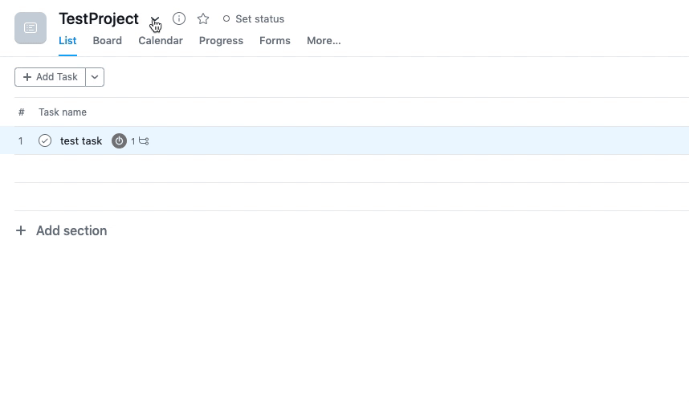

Converts

## Prerequisites:
1. Python 3.7+
2. Dependencies:`pip install -r requirements.txt`

## Usage
1. Obtain a JSON representation of your Asana project and save it to `<ProjectName>.json`

    

    You can also use [the exporter](https://github.com/Stvad/AsanaExport) I wrote to obtain a full snapshot of all your projects from all the workspaces.

2. Run `python roam_asana.py ProjectName.json output.json`

3. Import the resulting JSON file to Roam

## Details

1. Task notes are inserted as a child block
1. Subtask become child blocks
1. Tags and due dates are converted into Roam pages and inserted as a first child block under the respective task block
1. Sections are supported and tasks that are in a section are aggregated under the same block
1. This also supports converting [Asana bracket estimate hack](https://github.com/Stvad/RoamAsana) into Roam attribute